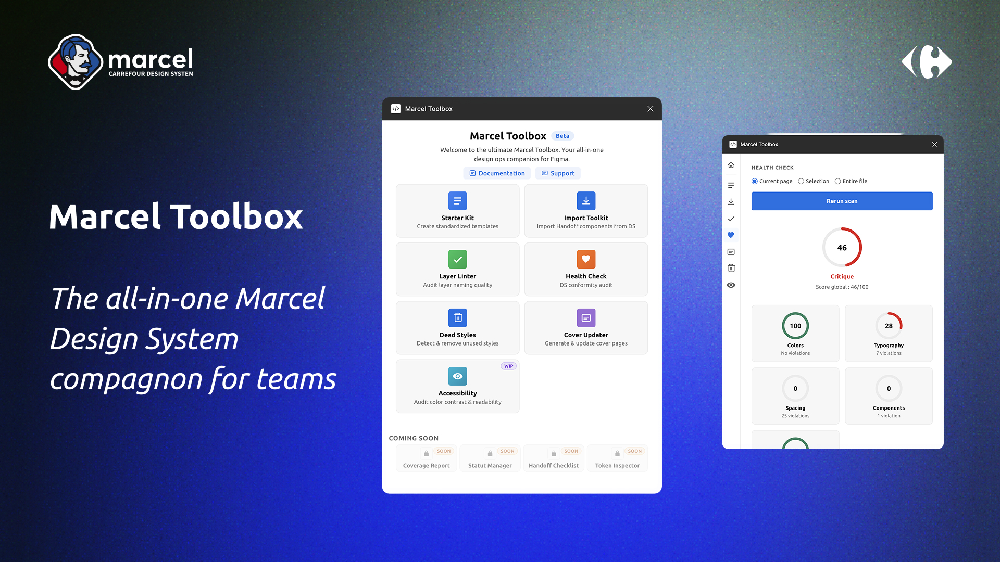

<p align="center">
  
</p>

<h1 align="center">Marcel Toolbox</h1>

<p align="center">
  <strong>The all-in-one DesignOps plugin for Figma.</strong><br/>
  Lint layers, audit DS compliance, clean unused styles, check accessibility — in one panel.
</p>

> **⚠️ Important:** This plugin is designed exclusively for use within the **Carrefour ecosystem**. It relies on internal Design System tokens, libraries, and component structures specific to Carrefour and will not function outside of this environment.

<p align="center">
  <a href="https://www.figma.com/community/plugin/1611477883396895317"></a>
  
  
  
</p>

<p align="center">
  
</p>

---

## ✨ Features at a Glance

| | Feature | Description |
|:---:|:---|:---|
| 🏗️ | [**Starter Kit**](#-starter-kit-generator) | Scaffold a standardized Figma file in one click |
| 🔍 | [**Layer Linter**](#-layer-naming-linter) | 17 rules to catch naming issues, with auto-fix |
| 🩺 | [**Health Check**](#-design-system-health-check) | Score your DS compliance across 5 categories |
| 🧹 | [**Style Cleaner**](#-dead-styles--style-cleaner) | Find & remove dead styles and foreign bindings |
| 🎨 | [**Cover Updater**](#-cover-updater) | Swap your project cover status in one click |
| 🧰 | [**Import Toolkit**](#-import-toolkit) | Import handoff components from DS library |
| ♿ | [**Accessibility**](#-accessibility-audit) | Contrast, alt text, touch targets + color blindness sim |

---

## 🏗️ Starter Kit Generator

Generates a complete, standardized file structure with real DS library components.

<table>
<tr>
<td width="50%">

**PRD Project template**
- 📄 Cover (auto-thumbnail)
- 📋 Overview (problem, goals, team)
- 🚀 Delivery pages
- 🧩 Local components
- 📦 Archives
- ❓ Help & documentation

</td>
<td width="50%">

**DS Library template**
- 🏁 Library Cover
- 📖 ReadMe
- 👩‍💻 Contributors
- 🧱 Component pages (×3)
- 📦 Archive section

</td>
</tr>
</table>

> Both templates import components directly from the published Marcel DS library — no manual setup needed.

---

## 🔍 Layer Naming Linter

Scans layers across **page**, **selection**, or **entire file** and flags naming issues with severity, confidence, and auto-fix suggestions.

### 17 Built-in Rules

<table>
<tr><td>

| Rule | What it catches |
|:--|:--|
| `default-names` | Frame 1, Rectangle 2… |
| `vague-names` | container, wrapper, div… |
| `duplicate-siblings` | Identical sibling names |
| `component-naming` | Missing `Category/Name` pattern |
| `long-names` | Names > configurable max |
| `special-chars` | Non-standard characters |
| `numbered-suffix` | Lazy Name 2, Name 3… |
| `text-mismatch` | Layer name ≠ text content |
| `empty-frames` | Frames with no children |

</td><td>

| Rule | What it catches |
|:--|:--|
| `excessive-nesting` | Deep nesting > threshold |
| `single-child-groups` | Unnecessary wrapper groups |
| `orphan-layers` | Layers outside any frame |
| `unused-components` | 0 instances in file |
| `non-token-colors` | Colors not in DS palette |
| `inconsistent-radius` | Mixed border-radius values |
| `mixed-fills` | Multiple fill types |
| `detached-styles` | Detached DS styles |

</td></tr>
</table>

**🛠️ Configurable:** toggle rules on/off, set custom vague names, ignore specific layers/pages, adjust auto-fix confidence threshold, component naming pattern, max name length, max nesting depth.

**📋 Allowlist:** ignore specific violations per-node — persisted across sessions.

---

## 🩺 Design System Health Check

Audits your file against DS tokens and returns a **0–100 weighted score** with per-category breakdowns.

```
┌─────────────────────────────────────────────────────┐
│  Overall Score: 87/100                              │
│                                                     │
│  🎨 Colors       ██████████████████░░  92           │
│  🔤 Typography   █████████████████░░░  85           │
│  📐 Spacing      ████████████████░░░░  82           │
│  🧩 Components   ███████████████████░  95           │
│  📊 Coverage     ████████████████░░░░  80           │
└─────────────────────────────────────────────────────┘
```

| Category | Checks |
|:--|:--|
| **🎨 Colors** | Fills & strokes vs. DS token palette |
| **🔤 Typography** | Font family, size, weight, line-height vs. DS type scale |
| **📐 Spacing** | Auto-layout padding & gap vs. DS spacing tokens |
| **🧩 Components** | Detached instances, component usage patterns |
| **📊 Coverage** | Instance classification: DS vs. local vs. uncategorized |

> Supports **auto-fix** per violation or **batch fix** by category.

---

## 🧹 Dead Styles & Style Cleaner

Two scan modes to keep your file clean:

<table>
<tr>
<td width="50%">

### 💀 Dead Styles
Finds **unused** local styles (paint, text, effect) defined in the file but applied nowhere.

- Delete individually
- Batch delete all

</td>
<td width="50%">

### 🔗 Style Cleaner
Detects **foreign** variable & style bindings from external libraries.

- **Detach** — keep visual, remove binding
- **Replace** — swap to nearest DS token
- Batch detach / replace all

</td>
</tr>
</table>

> Replacement prefers DS variable binding when available, falls back to hex color match.

---

## 🎨 Cover Updater

Updates your project cover in one click. Swaps the cover instance to match your project status:

<table>
<tr>
<td align="center">🟢<br/><strong>In Progress</strong></td>
<td align="center">✅<br/><strong>Design Done</strong></td>
<td align="center">📦<br/><strong>Archived</strong></td>
<td align="center">📌<br/><strong>SOT</strong></td>
<td align="center">🎮<br/><strong>Playground</strong></td>
</tr>
</table>

> Reads from the published Marcel DS library — the cover component is always up to date.

---

## 🧰 Import Toolkit

Import handoff components from the [DS Toolkit library](https://www.figma.com/design/Jf6rZlFn5xwhy1xcvvlJq2/-DS--Toolkit-2.0.0) directly into your current page — no manual copy-paste needed.

### Component Categories

<table>
<tr>
<td width="25%">

**🔵 Dots** (2)
- Circle Pin
- Pixels

</td>
<td width="25%">

**📝 Notes** (6)
- Post-it
- Quote
- Thoughts
- Highlight
- Screen
- Specs Card

</td>
<td width="25%">

**🔗 Links** (5)
- Shortcut
- Button Link
- Card Link
- Device
- Flow

</td>
<td width="25%">

**🧱 Toolkit DS** (7)
- Component Card
- Header Black L
- Subtitle
- Body
- Component Name
- Project Card
- Delivery Header

</td>
</tr>
</table>

> Components are imported as instances from the published DS library — always in sync with the latest version.

---

## ♿ Accessibility Audit

Comprehensive a11y checker with scoring and visual tools.

### Audit Categories

| Category | Standard | What it checks |
|:--|:--|:--|
| **🖼️ Alt Text** | WCAG 1.1.1 | Images missing alternative text |
| **🔲 Contrast** | WCAG AA / AAA | Text-to-background color contrast ratios |
| **👆 Touch Targets** | WCAG 2.5.8 | Interactive elements < 44×44 px |

### Visual Tools

| Tool | Description |
|:--|:--|
| **🏷️ Alt Text Badges** | Overlay badges on images showing alt text status (✅ present / ❌ missing) |
| **👁️ Color Blindness Sim** | Generates simulated views for protanopia, deuteranopia, tritanopia — output to new pages or inline |

---

## 🗂️ Project Structure

```
Marcel/
├── manifest.json                # Figma plugin manifest
├── package.json                 # Dependencies & scripts
├── esbuild.config.mjs           # Build config
└── src/
    ├── main.ts                  # Plugin controller (message routing)
    ├── ui.html                  # Plugin UI panel (single-file HTML)
    ├── features/
    │   ├── starter-kit/         # 🏗️ Project scaffolding
    │   ├── linter/              # 🔍 Layer naming linter
    │   ├── health-check/        # 🩺 DS health check
    │   ├── dead-styles/         # 🧹 Style cleanup
    │   ├── cover-updater/       # 🎨 Cover management
    │   └── accessibility/       # ♿ A11y audit
    └── shared/                  # Shared utilities
        ├── node-traversal.ts    # Async traversal with abort
        ├── scoring.ts           # Weighted scoring engine
        ├── tokens.ts            # DS token definitions
        ├── storage.ts           # Persistent config (clientStorage)
        └── violation-types.ts   # Shared violation model
```

---

## 🚀 Getting Started

### Prerequisites

- **Node.js** >= 18
- **Figma Desktop** app

### Install & Build

```bash
cd Marcel
npm install
npm run build
```

### Load in Figma

1. Open Figma Desktop
2. **Plugins** → **Development** → **Import plugin from manifest…**
3. Select `Marcel/manifest.json`
4. Run from **Plugins** → **Development** → **Marcel Toolbox**

### Development (watch mode)

```bash
npm run watch
```

Changes to `src/` rebuild automatically — reload the plugin in Figma to see updates.

---

## 🏛️ Architecture

```
┌──────────────┐     postMessage      ┌──────────────┐
│              │  ──────────────────►  │              │
│   ui.html    │                      │   main.ts    │
│   (iframe)   │  ◄──────────────────  │  (sandbox)   │
│              │     postMessage       │              │
└──────────────┘                      └──────┬───────┘
                                             │
                                    ┌────────┴────────┐
                                    │   features/*    │
                                    │                 │
                                    │  traverseNodes()│
                                    │  + abort tokens │
                                    │  + scoring      │
                                    │  + auto-fix     │
                                    └─────────────────┘
```

| Concept | Detail |
|:--|:--|
| **Message-based** | UI ↔ Controller communicate via `postMessage`. All heavy work runs in the Figma sandbox. |
| **Async + cancellable** | Shared `traverseNodes()` with abort tokens — users can cancel long scans anytime. |
| **Weighted scoring** | Errors weigh more than warnings, warnings more than info → 0–100 scores. |
| **Persistent config** | Linter settings & cover config stored per-document via `clientStorage`. |
| **DS token validation** | All checks compare against the Marcel DS token set (colors, typography, spacing). |

---

## 🛠️ Tech Stack

<table>
<tr>
<td><strong>Language</strong></td>
<td>TypeScript 5.9</td>
</tr>
<tr>
<td><strong>Bundler</strong></td>
<td>esbuild — IIFE format, ES2017 target</td>
</tr>
<tr>
<td><strong>UI</strong></td>
<td>Single-file HTML with inline CSS & Ubuntu font</td>
</tr>
<tr>
<td><strong>Figma API</strong></td>
<td>Plugin API 1.0.0 — <code>teamlibrary</code> + <code>currentuser</code> permissions</td>
</tr>
<tr>
<td><strong>Color science</strong></td>
<td><a href="https://culorijs.org/">culori</a> — contrast ratios & color blindness simulation</td>
</tr>
</table>

---

<p align="center">
  <br/>
  <sub>Built with ❤️ for the Marcel design team.</sub>
</p>
